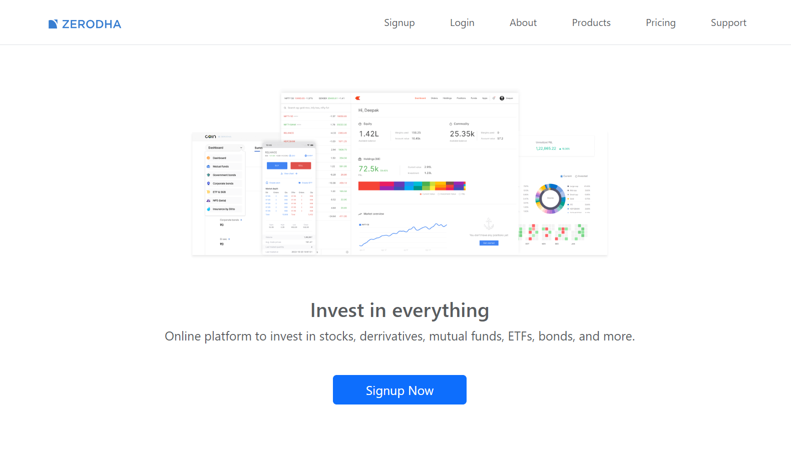
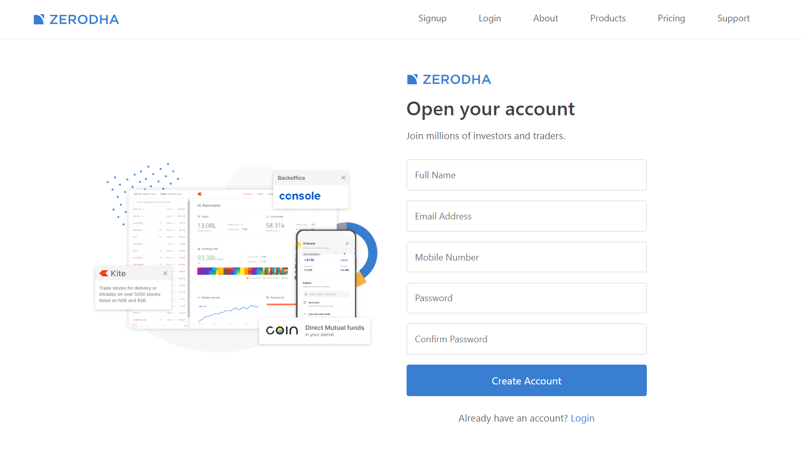
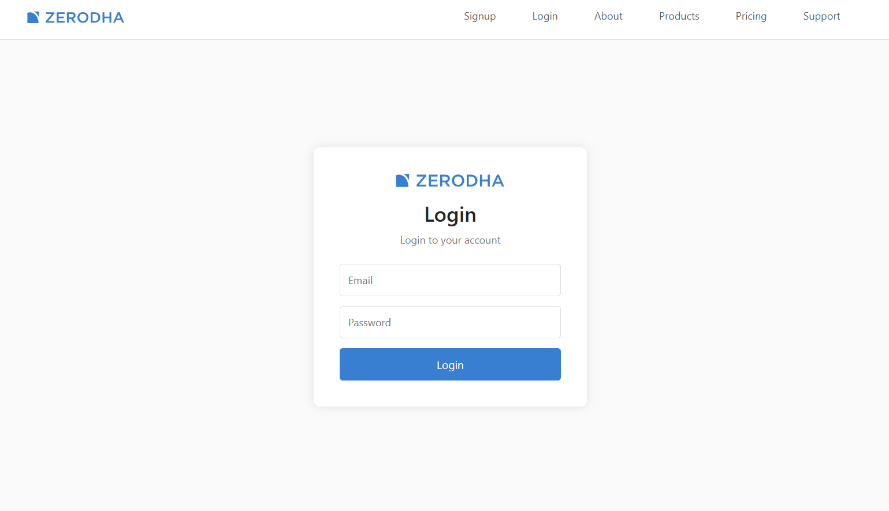
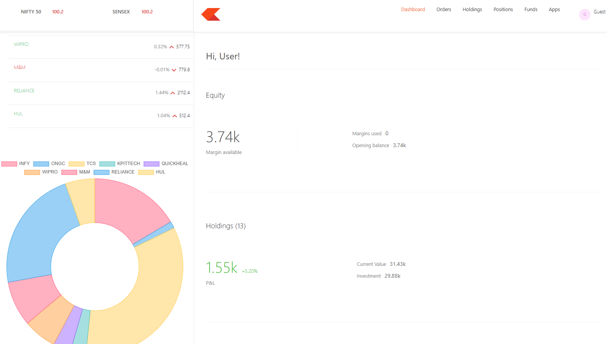
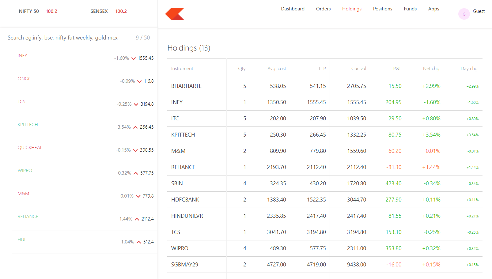
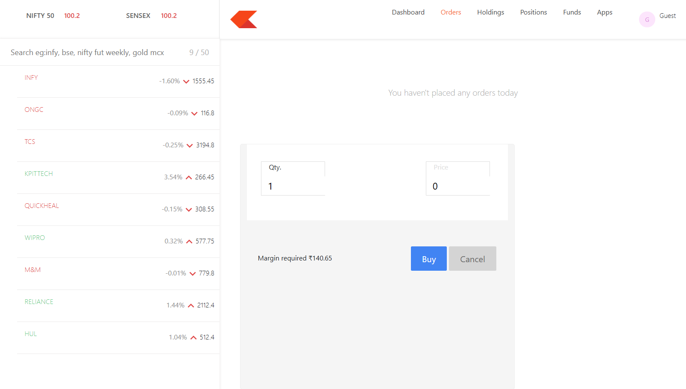

# 📈 Trading Platform

<p align="center">


</p>

A full-stack **MERN Trading Platform** inspired by Zerodha, built for learning and portfolio purposes. The application provides secure authentication, portfolio management, holdings, positions, and stock buy/sell functionality through an interactive trading dashboard.

---

# 🚀 Live Demo

🌐 **Live Application**

https://trading-platform-uoc8.vercel.app

---

# ✨ Features

- 🔐 Secure User Authentication (Signup & Login)
- 🛡 JWT-based Authentication & Authorization
- 📊 Interactive Trading Dashboard
- 💼 Holdings Management
- 📈 Positions Tracking
- 🛒 Buy Stocks
- 💰 Sell Stocks
- 🔒 Protected Dashboard Routes
- 📡 REST API Integration
- ☁️ Cloud Deployment
- 📱 Responsive User Interface

---

# 🛠 Tech Stack

### Frontend
- React.js
- React Router DOM
- Bootstrap 5
- Axios

### Backend
- Node.js
- Express.js
- JWT Authentication
- bcrypt.js

### Database
- MongoDB Atlas
- Mongoose

### Deployment
- Frontend – Vercel
- Dashboard – Vercel
- Backend – Render

---

# 📸 Application Preview

## 🏠 Home Page



---

## 📝 Signup



---

## 🔐 Login



---

## 📊 Dashboard



---

## 💼 Holdings



---

## 🛒 Buy Order



---

# 📂 Project Structure

```text
trading-platform
│
├── backend
│
├── dashboard
│
├── frontend
│
├── screenshots
│   ├── home.png
│   ├── signup.png
│   ├── login.png
│   ├── dashboard.png
│   ├── holdings.png
│   └── buy-order.png
│
├── README.md
└── LICENSE
```

---

# ⚙️ Getting Started

## Clone the Repository

```bash
git clone https://github.com/honeyAswani/trading-platform.git
```

```bash
cd trading-platform
```

---

## Install Dependencies

### Frontend

```bash
cd frontend
npm install
```

### Dashboard

```bash
cd dashboard
npm install
```

### Backend

```bash
cd backend
npm install
```

---

# 🔐 Environment Variables

Create a `.env` file inside the **backend** directory.

```env
MONGO_URL=your_mongodb_connection_string

JWT_SECRET=your_secret_key

PORT=3002
```

---

# ▶️ Run Locally

### Backend

```bash
npm start
```

### Frontend

```bash
npm run dev
```

### Dashboard

```bash
npm run dev
```

---

# 🚀 Future Improvements

- 📈 Live Stock Market API Integration
- ⭐ Watchlist Feature
- 📜 Order History
- 📊 Portfolio Analytics
- 📧 Email Verification
- 🌙 Dark Mode

---

# 👩‍💻 Author

**Honey Aswani**

- GitHub: https://github.com/honeyAswani

---

# 🙏 Acknowledgements

This project was inspired by the user experience and workflow of Zerodha. It was independently developed using the MERN stack for educational and portfolio purposes.

---

## ⭐ Show Your Support

If you found this project helpful, consider giving it a ⭐ on GitHub.
